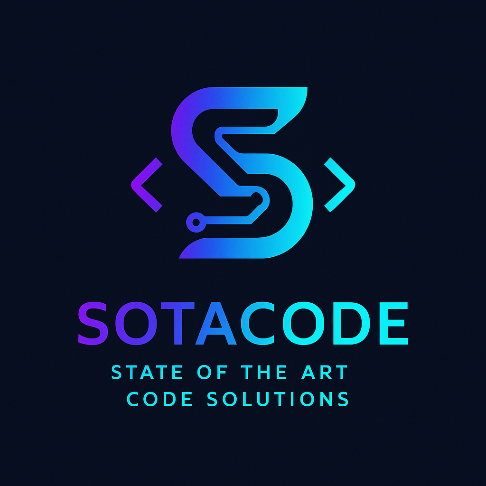

  

<h1 align="center">SotACode - State of the Art Code Solutions</h1>

  <em>Лучшие компоненты и шаблоны кода для вайбкодинга</em>
   
  <a href="https://github.com/ilialor/SotACode/issues/new?assignees=&labels=bug&template=bug_report.md&title=">Сообщить об ошибке</a>
  ·
  <a href="https://github.com/ilialor/SotACode/issues/new?assignees=&labels=enhancement&template=feature_request.md&title=">Предложить улучшение</a>
  ·
  <a href="docs/README.md">Документация проекта (Docs)</a>

<!-- Щитки (Badges) - Замените их на свои, если есть -->

  
  
  
  
  

## О проекте | About The Project

**SotACode** — это проект, призванный предоставить коллекцию самых современных (State of the Art) компонентов и шаблонов кода, готовую для вайбкодинга. Наша миссия — оптимизировать процессы разработки, предлагая многократно используемые, высококачественные решения для распространенных задач программирования.

**SotACode** is a pioneering project dedicated to providing developers with a comprehensive collection of state-of-the-art code components and templates. Our mission is to streamline development processes by offering reusable, high-quality solutions for common programming challenges.

### Ключевые ресурсы | Key Resources:
*   **[Топ-20 часто используемых компонентов](docs/top-20.md)**: Подробное руководство по наиболее распространенным строительным блокам в приложениях Node.js/TypeScript и Python.
    *   **[Top 20 Frequently Used Components](docs/top-20.md)**: A detailed guide to the most common building blocks in Node.js/TypeScript and Python applications.
*   **[Топ-25+ планируемых компонентов и шаблонов](docs/top-25-list.md)**: Наша дорожная карта для будущих многократно используемых решений, включая интеграцию с AI/ML и многое другое.
    *   **[Top 25+ Planned Components and Templates](docs/top-25-list.md)**: Our roadmap for future reusable solutions, including AI/ML integration, and more.
*   **[Стандарты для модулей](docs/module_standards.md)**: Принципы и стандарты, которым должны соответствовать все модули проекта SotACode.
    *   **[Module Standards](docs/module_standards.md)**: Principles and standards that all SotACode project modules must adhere to.
*   **[План реализации проекта](docs/plan.md)**: Общий план и этапы развития проекта.
    *   **[Project Implementation Plan](docs/plan.md)**: The overall plan and development stages of the project.

## Начало работы | Getting Started

Чтобы начать работу с SotACode, ознакомьтесь с нашей документацией и примерами.
(Здесь будет информация о том, как использовать компоненты)

To get started with SotACode, please refer to our documentation and examples.
(Information on how to use the components will be here)

## Участие | Contributing

Мы приветствуем любой вклад в развитие проекта SotACode! Если вы хотите внести свой вклад, пожалуйста, ознакомьтесь с нашим руководством для контрибьюторов (файл `CONTRIBUTING.md` будет добавлен позже).

Contributions are what make the open-source community such an amazing place to learn, inspire, and create. Any contributions you make are **greatly appreciated**. Please check our contributing guidelines (file `CONTRIBUTING.md` to be added later).

1.  Форкните проект (Fork the Project)
2.  Создайте свою ветку для новой функциональности (`git checkout -b feature/AmazingFeature`)
3.  Закоммитьте ваши изменения (`git commit -m 'Add some AmazingFeature'`)
4.  Отправьте изменения в свою ветку (`git push origin feature/AmazingFeature`)
5.  Откройте Pull Request

## Лицензия | License

Распространяется под лицензией MIT. Смотрите `LICENSE` для получения дополнительной информации.
Distributed under the MIT License. See `LICENSE` for more information.
