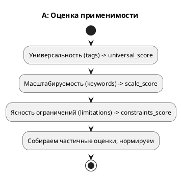
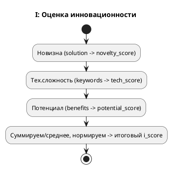
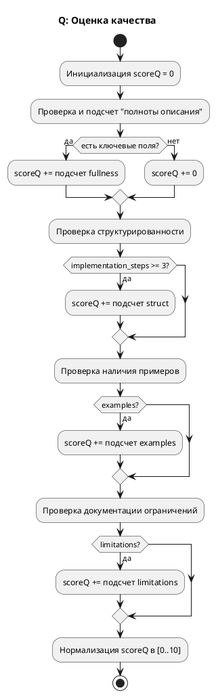
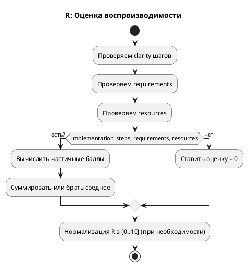
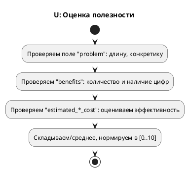

# A.I.Q.R.U.
## Применимость (A)

Подпункты:
1. **Универсальность** (Universality)
2. **Масштабируемость** (Scalability)
3. **Ясность ограничений** (Constraints Clarity)

### Универсальность

**Идея алгоритма**:
1. Смотрим `tags` или разделы, в которых можно применять.
2. Чем больше доменов/областей, тем выше балл.

**Псевдокод**:
```
universal_score = 0
if "tags" in practice:
    distinct_tags = set(practice["tags"])
    # например, балл = min(кол-во уникальных тэгов, 5)
    universal_score = min(len(distinct_tags), 5)
a_universal = (universal_score / 5) * 10

### Масштабируемость

**Идея алгоритма**:
1. Проверяем текст `implementation_requirements` и `solution`.
2. Ищем ключевые слова: «scalable», «adapt», «cloud», «multi-tenant» и т. д.
3. Чем больше таких упоминаний, тем выше балл.

**Псевдокод**:
```
scale_score = 0
keywords = ["scale", "adapt", "modular", "cloud", "horizontal"]
text_fields = (practice["implementation_requirements"] + [practice["solution"]])
hits = 0
for field in text_fields:
    for kw in keywords:
        if kw in field.lower():
            hits += 1
scale_score = min(hits, 3)
a_scale = (scale_score / 3) * 10
```

### Ясность ограничений

**Идея алгоритма**:
1. Смотрим поле `limitations` (дополнительно `tags`, если там что-то об ограничениях).
2. Если чётко прописано, где и как нельзя применять, + баллы.

**Псевдокод**:
```
constraints_score = 0
if "limitations" in practice:
    # Чем детальнее описаны ограничения, тем выше балл
    total_detail = 0
    for limit in practice["limitations"]:
        total_detail += (len(limit) >= 50) ? 1 : 0.5
    constraints_score = min(total_detail, 4)
a_constraints = (constraints_score / 4) * 10


Схема для «A» (Activity Diagram)



---
##  Инновационность (I)

Подпункты:
1. **Новизна подхода** (Novelty)
2. **Технологическая сложность** (Tech Complexity)
3. **Потенциал развития** (Future Potential)

### Новизна подхода

**Идея алгоритма**:
1. Проверить `solution` на наличие слов: «new», «original», «novel», «pioneering» и т. п.
2. Проверить, нет ли упоминаний о старых технологиях (напр. legacy) — тогда балл ниже.
3. Возможно, анализировать ссылки на научные статьи, патенты.

**Псевдокод**:
```
novelty_score = 0
if "solution" in practice:
    text = practice["solution"].lower()
    keywords_novel = ["new", "novel", "unique", "original", "innovative"]
    for kw in keywords_novel:
        if kw in text:
            novelty_score += 1
    novelty_score = min(novelty_score, 4)
i_novelty = (novelty_score / 4) * 10
```

### Технологическая сложность

**Идея алгоритма**:
1. Смотрим `implementation_requirements`, `solution` и т. п.
2. Если есть AI/ML, blockchain, microservices, cloud-native, и т. д. — увеличиваем балл.
3. Можно учитывать «stack» (Python/C++/CUDA).

**Псевдокод**:
```
tech_score = 0
keywords_tech = ["ai", "ml", "blockchain", "cloud", "distributed", "microservices"]
all_text = (practice["implementation_requirements"] + [practice["solution"]])
hits = 0
for part in all_text:
    part_low = part.lower()
    for kw in keywords_tech:
        if kw in part_low:
            hits += 1
tech_score = min(hits, 3)
i_complexity = (tech_score / 3) * 10
```

### Потенциал развития

**Идея алгоритма**:
1. Проверяем `benefits` и `solution` на слова: «future», «extensible», «scalable», «long-term».
2. Можно смотреть, упоминается ли «следующие версии», «roadmap», «планы развития».

**Псевдокод**:
```
potential_score = 0
if "benefits" in practice:
    for b in practice["benefits"]:
        if any(kw in b.lower() for kw in ["future", "potential", "extensible", "scalable"]):
            potential_score += 1
potential_score = min(potential_score, 3)
i_potential = (potential_score / 3) * 10
```

### Схема для «I» (Activity Diagram)



## Качество (Q)

Критерий «Качество» содержит четыре подпункта:
1. **Полнота описания** (Fullness of Description)
2. **Структурированность** (Structuring)
3. **Наличие примеров** (Examples)
4. **Документация ограничений** (Limitations Documentation)

### Полнота описания

**Идея алгоритма**:
1. Проверить, присутствуют ли ключевые поля (title, summary, problem, solution).
2. Для каждого поля вычислить длину текста.
3. Вычислить «глубину» (например, есть ли подзаголовки, иллюстрации, графики и т. д. — если такие данные доступны).
4. На основе набора (количество полей + длина каждого поля + подробность) вычислить частичную оценку (в диапазоне 0–3 или 0–5).

**Псевдокод**:
```
fullness_score = 0
required_fields = ["title", "summary", "problem", "solution"]
for field in required_fields:
    if field in practice and not empty(practice[field]):
        length = len(practice[field])
        # Пример порогов: <50 (минимум), <200 (средне), >=200 (подробно)
        if length >= 200:
            fullness_score += 3
        elif length >= 50:
            fullness_score += 2
        else:
            fullness_score += 1

# Допустим, max_score = 3 * len(required_fields) = 12
# Далее нормализуем в диапазон [0..10], если нужно
score_fullness = (fullness_score / 12) * 10
```

### Структурированность

**Идея алгоритма**:
1. Проверить наличие полей со структурой (например, implementation_steps).
2. Проверить, есть ли подзаголовки, нумерация, разделы (при желании — регулярными выражениями).
3. Оценить, насколько логически выстроен текст (при наличии алгоритмов NLP можно анализировать последовательность шагов).

**Псевдокод**:
```
structure_score = 0
if "implementation_steps" in practice:
    steps = practice["implementation_steps"]
    if len(steps) >= 3:
        structure_score += 2
    elif len(steps) > 0:
        structure_score += 1

# При желании считываем и остальные разделы, подсчитываем "баллы" за наличие структуры
# max_points = 2 (или более, если расширять)
score_structure = (structure_score / 2) * 10
```

### Наличие примеров

**Идея алгоритма**:
1. Проверить поле `examples` (или искать внутри `solution`, `summary` указание на пример).
2. Если есть примеры кода/использования — повысить балл.

**Псевдокод**:
```
examples_score = 0
if "examples" in practice:
    if len(practice["examples"]) == 0:
        examples_score = 0
    elif 1 <= len(practice["examples"]) <= 2:
        examples_score = 1
    else:
        examples_score = 2

# max_points = 2
score_examples = (examples_score / 2) * 10
```

### Документация ограничений

**Идея алгоритма**:
1. Проверить поле `limitations`.
2. Оценить не только количество, но и «детальность».

**Псевдокод**:
```
limitations_score = 0
if "limitations" in practice:
    # Считаем за каждую упомянутую ограниченность/риск
    detail_sum = 0
    for limit in practice["limitations"]:
        # Простейший вариант: смотрим длину описания ограничения
        detail_sum += (len(limit) >= 50) ? 2 : 1
    limitations_score = min(detail_sum, 4)  # например, максимум 4
score_limitations = (limitations_score / 4) * 10
```

### Общая схема для «Q» (пример Activity Diagram)



---
## Воспроизводимость (R)

Подпункты:
1. **Чёткость шагов реализации** (Implementation Steps Clarity)
2. **Определённость требований** (Requirements Specificity)
3. **Оценка необходимых ресурсов** (Resources Estimation)

### Чёткость шагов реализации

**Идея алгоритма**:
1. Проанализировать массив `implementation_steps`.
2. Для каждого шага проверять наличие хотя бы короткого описания (более продвинутый вариант — проверять «операторные» глаголы, показатели уровня детализации).
3. Итоговая оценка = средняя оценка по всем шагам.

**Псевдокод**:
```
clarity_score = 0
max_points = 0
if "implementation_steps" in practice:
    for step in practice["implementation_steps"]:
        if "description" in step:
            desc_len = len(step["description"])
            if desc_len > 100:
                clarity_score += 1
            else:
                clarity_score += 0.5
            max_points += 1
if max_points == 0:
    r_steps = 0
else:
    r_steps = (clarity_score / max_points) * 10
```

### Определённость требований

**Идея алгоритма**:
1. Смотрим поле `implementation_requirements`.
2. Чем больше конкретных пунктов (или чем подробнее описания), тем выше оценка.
3. Можно проверять ключевые слова (названия библиотек, версий, спецификаций и т. д.).

**Псевдокод**:
```
reqs_score = 0
if "implementation_requirements" in practice:
    count = len(practice["implementation_requirements"])
    # например, 0..3 балла
    reqs_score = min(count, 3)
r_reqs = (reqs_score / 3) * 10
```

### Оценка ресурсов

**Идея алгоритма**:
1. Смотрим поле `estimated_resources`.
2. Проверяем наличие конкретных указаний (GPU, сервер, кол-во людей, библиотека X и т. д.).
3. Считаем, сколько «осмысленных» ресурсов описано.

**Псевдокод**:
```
resources_score = 0
if "estimated_resources" in practice:
    resources_list = practice["estimated_resources"]
    # Каждая упомянутая единица = 1 балл, максимум 3
    resources_score = min(len(resources_list), 3)
r_resources = (resources_score / 3) * 10
```

### Схема для «R» (Activity Diagram)



---
## Полезность (U)

Подпункты:
1. **Ясность описания проблемы** (Problem Clarity)
2. **Конкретность выгод** (Benefits Specificity)
3. **Оценка эффективности** (Efficiency/Efficacy)

### Ясность описания проблемы

**Идея алгоритма**:
1. Смотрим поле `problem`.
2. Чем дольше и подробнее описание, тем выше базовый балл.
3. Можно дополнительно оценивать «наличие метрик» (например, «сокращение времени на 30%»).

**Псевдокод**:
```
problem_len = len(practice["problem"]) if "problem" in practice else 0
if problem_len == 0:
    clarity = 0
elif problem_len < 100:
    clarity = 3
else:
    clarity = 5
u_problem = (clarity / 5) * 10
```

### Конкретность выгод

**Идея алгоритма**:
1. Смотрим `benefits`.
2. Если выгоды количественно измеримы — + баллы.
3. Если выгоды неочевидны — меньше баллов.

**Псевдокод**:
```
benefit_score = 0
if "benefits" in practice:
    for b in practice["benefits"]:
        # проверяем есть ли числа, проценты, ROI
        if contains_numbers(b):
            benefit_score += 1
        else:
            benefit_score += 0.5
    benefit_score = min(benefit_score, 4)
u_benefits = (benefit_score / 4) * 10
```

### Оценка эффективности

**Идея алгоритма**:
1. Проверяем поля `estimated_financial_cost`, `estimated_time_cost`.
2. Сравниваем «затраты» и «выгоды» (если есть метрики).
3. Чем более конкретна эффективность (ROI, KPI), тем выше балл.

**Псевдокод**:
```
eff_score = 0
if "estimated_financial_cost" in practice:
    eff_score += 1
if "estimated_time_cost" in practice:
    eff_score += 1
# проверяем, есть ли в benefits упоминания реальных цифр?
if "benefits" in practice and has_measurable_benefits(practice["benefits"]):
    eff_score += 1
# max = 3
u_eff = (eff_score / 3) * 10
```

### Схема для «U» (Activity Diagram)



## Заключение

1. **Каждый подпункт** имеет собственный простой алгоритм (часто — счётчик ключевых слов, длины, количества пунктов и т. д.).
2. **Нормализация** обычно делается к диапазону [0..10], но может быть и иная (0–5, 0–100).
3. **Итоговые оценки** по каждому критерию (A.I.Q.R.U.) можно агрегировать (например, взвешенным средним) в общий «sota_score».

**Vожно и нужно усложнить** эти алгоритмы, используя NLP-библиотеки (например, spaCy, NLTK), эвристику качества текста (BERTScore, Coh-Metrix) или специализированные модели для анализа структуры. Предложенные базовые механизмы дают понятную отправную точку для формальной оценки A.I.Q.R.U.

---
